# System Models

System models define the assumptions under which a distributed-system design is correct.

Before choosing a pattern such as leader election, replication, quorum, consensus, leases, or retries, make the model explicit:

- What can happen to messages?
- What can happen to nodes?
- What timing guarantees exist?

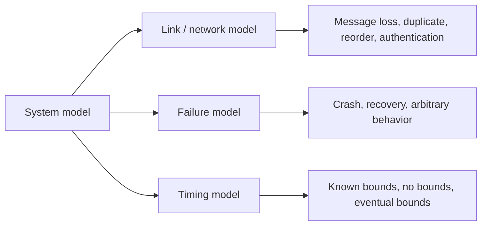

## Why this is required

A distributed protocol is only correct under a set of assumptions.

For example, a timeout-based leader election behaves differently depending on the timing model:

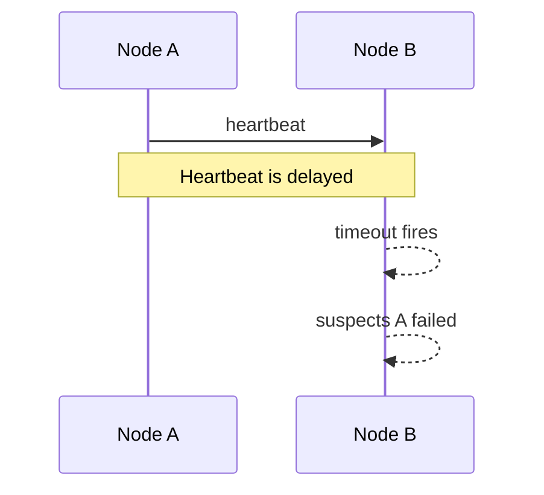

In a synchronous model, a timeout can be strong evidence of failure. In an asynchronous model, it only means "I have not heard back yet." The node may be crashed, slow, paused by GC, or separated by a network partition.

That is why system models matter: they prevent vague design claims. A better design statement is:

> Under crash-recovery failures, reliable links, and partial synchrony, this protocol preserves safety always and makes progress once the network stabilizes.

## Three groups of models

| Group | Question it answers | Examples |
|---|---|---|
| Link / network model | What can happen to messages? | Fair-loss link, reliable link, authenticated reliable link |
| Failure model | What can happen to nodes? | Crash-stop, crash-recovery, arbitrary / Byzantine failure |
| Timing model | What can be assumed about time and delay? | Synchronous, asynchronous, partially synchronous |

## Link / network models

### Fair-loss link

A fair-loss link is the weakest useful network abstraction.

It assumes messages can be lost, duplicated, and reordered. But if a correct sender keeps sending the same message to a correct receiver, eventually some copy is delivered.

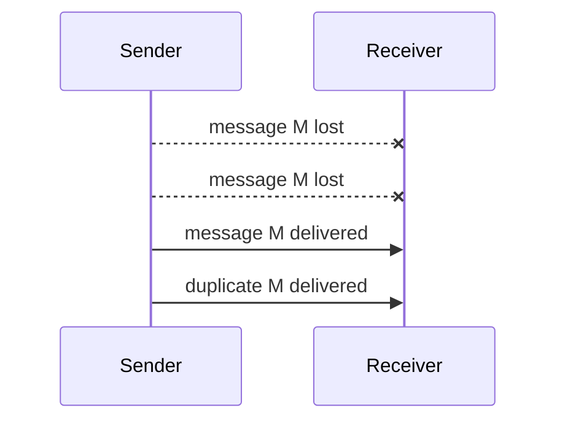

Use this as the base model for unreliable networks. Build stronger abstractions using retries, acknowledgements, message ids, and deduplication.

Key idea:

```text
Send once    -> may be lost
Send forever -> eventually some copy arrives
```

### Reliable link

A reliable link is usually built on top of a fair-loss link.

It gives three guarantees between correct nodes:

| Guarantee | Meaning |
|---|---|
| Validity | If A sends message `M` to B, B eventually delivers `M`. |
| No duplication | B does not deliver the same message more than once. |
| No creation | B does not deliver a message that A never sent. |

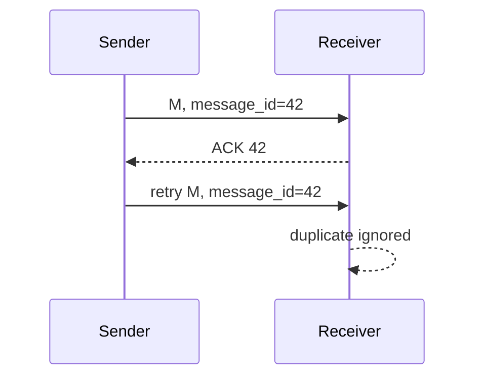

Important: reliable link does not mean the physical network never drops packets. It means the messaging layer hides loss and duplicates.

### Authenticated reliable link

An authenticated reliable link is a reliable link plus sender identity and message integrity.

If B receives a message claiming to be from A, then A really sent it and the message was not modified.

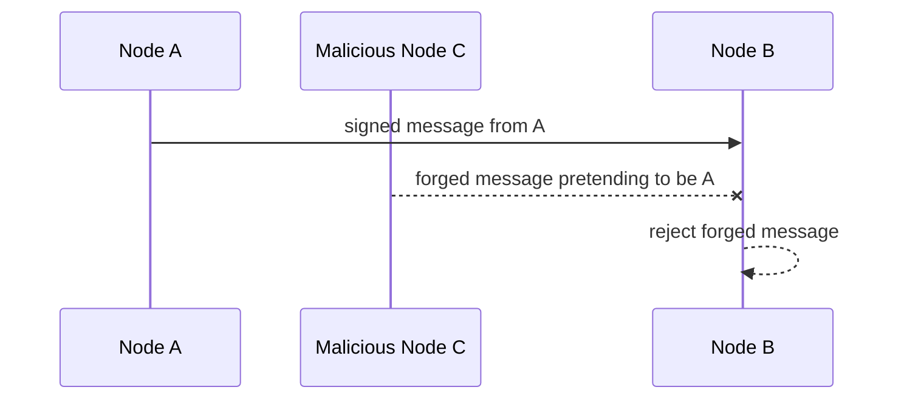

This is required when the system must tolerate arbitrary or Byzantine failures. It is commonly implemented using signatures, MACs, TLS, or mTLS depending on the threat model.

Authentication gives identity and integrity. It does not automatically imply confidentiality unless encryption is also used.

## Failure models

### Crash-stop

In the crash-stop model, a node behaves correctly until it crashes. After it crashes, it never returns.

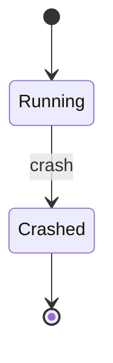

The node does not lie, corrupt messages, or send conflicting data. It simply stops.

This model is useful for reasoning about basic replication, leader election, and consensus safety. In real systems, detecting crash-stop is still hard because a silent node may be dead, slow, or partitioned.

### Crash-recovery

In the crash-recovery model, a node can crash and later restart.

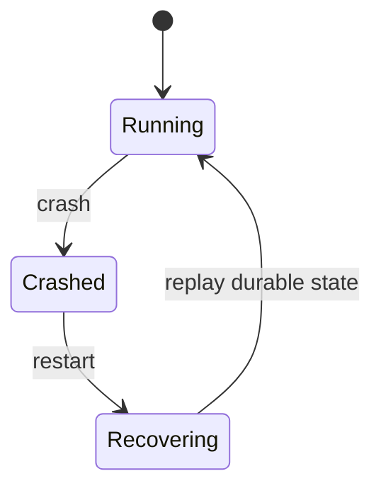

This is closer to production systems, where processes, containers, VMs, and hosts restart.

The key question is: what state survives the crash?

| State type | Survives crash? | Examples |
|---|---:|---|
| Volatile memory | No | in-memory counters, unflushed buffers, local caches |
| Stable storage | Yes | write-ahead log, Raft term, voted-for record, committed offsets |

Crash-recovery protocols must persist critical state before acknowledging operations. Otherwise, a restarted node can forget decisions and violate safety.

Example: in Raft-like systems, a node must persist its current term, vote, and log entries at the correct points before responding.

### Arbitrary / Byzantine failure

In the arbitrary failure model, a node can behave in any incorrect way.

It can lie, send different values to different peers, corrupt messages, ignore protocol rules, or act maliciously.

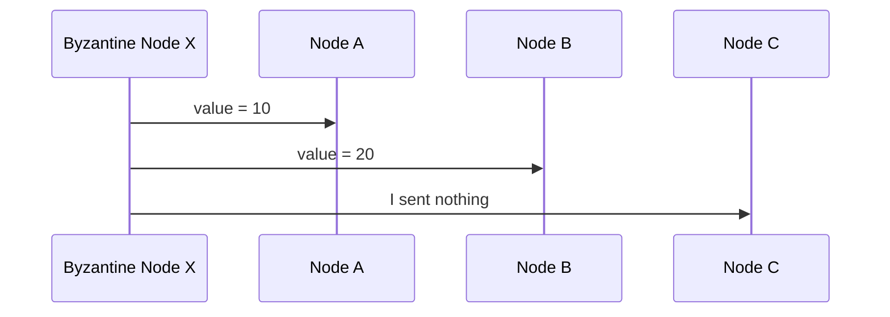

This is much harder than crash failure because silence is easier to tolerate than lies.

Arbitrary failures require stronger protocols such as Byzantine fault-tolerant consensus, authenticated messages, and larger quorums.

Typical use cases:

- Blockchains
- Cross-organization ledgers
- Systems with mutually distrusting participants
- Security-sensitive distributed control planes

Most internal company systems do not assume Byzantine failures for every service. They usually assume crash-recovery plus authentication, authorization, audit, and operational controls.

## Timing models

### Synchronous

A synchronous system has known upper bounds.

Example assumptions:

```text
Message delivery <= 100 ms
Process step <= 10 ms
Clock drift <= 5 ms
```

If a response does not arrive within the known bound, the system can treat the node as failed.

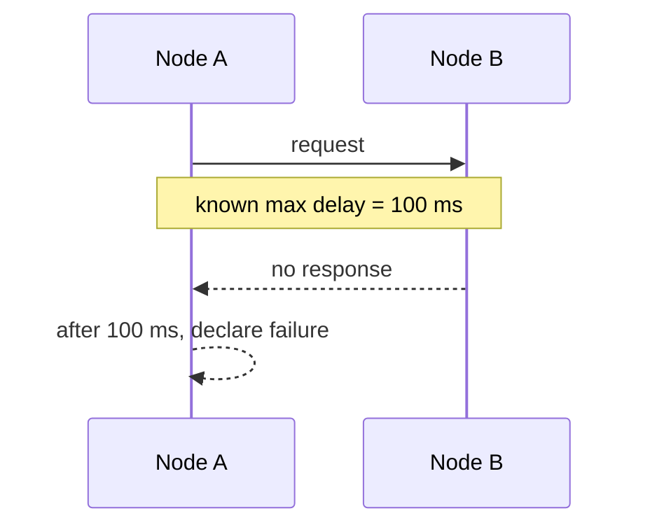

This model is easy to reason about, but it is usually too strong for real production systems because networks, disks, CPUs, garbage collection, and schedulers can all introduce unpredictable delay.

### Asynchronous

An asynchronous system has no timing guarantees.

Messages can be delayed arbitrarily. Processes can pause arbitrarily. Clocks cannot be trusted for correctness.

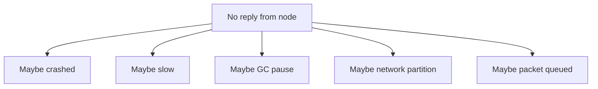

Key consequence:

> You cannot reliably distinguish a crashed node from a slow node.

In this model, timeouts are only suspicions. They are not proof.

This is why robust systems use quorum, epochs, fencing tokens, leases with care, idempotency, and consensus instead of relying only on timeout decisions.

### Partially synchronous

Partial synchrony is the practical production model.

The system can behave asynchronously for a while, but eventually it becomes synchronous enough for progress.

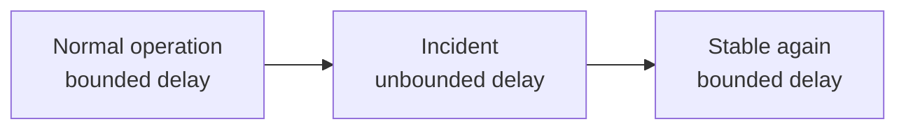

This is the model behind many practical consensus systems.

The important distinction:

| Property | Requirement |
|---|---|
| Safety | Must hold even during bad timing periods. Never commit two conflicting decisions. |
| Liveness | May require the system to stabilize. Progress resumes when messages arrive within reasonable bounds. |

Raft, Paxos-style systems, ZooKeeper, etcd, and Consul are usually reasoned about this way: safety does not depend on timing; progress needs enough synchrony to elect a stable leader and exchange quorum messages.

## Compact table

| Model | Meaning | What can go wrong? | Typical solution / design impact |
|---|---|---|---|
| Fair-loss link | Messages may be lost, duplicated, or reordered, but repeated sends eventually get through. | Loss, duplicate delivery, reordering. | Retry, ACK, sequence number, message id, deduplication. |
| Reliable link | Correct sender to correct receiver eventually delivers each message once. | Underlying packets may still be lost; abstraction hides it. | Implement over fair-loss links with retry + ACK + dedup. |
| Authenticated reliable link | Reliable delivery plus verified sender identity and message integrity. | Impersonation and tampering are rejected. | TLS, mTLS, MACs, signatures; needed for Byzantine settings. |
| Crash-stop | Node runs correctly, then crashes forever. | Node becomes silent and never returns. | Replication, failure detection, leader election, quorum. |
| Crash-recovery | Node can crash and later restart. | Volatile state is lost; stale node may rejoin. | Stable storage, WAL, replay, epochs, fencing, recovery protocol. |
| Arbitrary / Byzantine failure | Node can behave in any incorrect or malicious way. | Lies, conflicting messages, protocol violation, corruption. | Authenticated messages, BFT consensus, larger quorums. |
| Synchronous | Known bounds on message delay, processing time, and clock drift. | If bounds are wrong, false failure decisions happen. | Fixed timeouts can be meaningful under the assumed bounds. |
| Asynchronous | No bounds on delay, process speed, or clock drift. | Cannot distinguish slow from dead. | Avoid correctness depending on time; use quorum/consensus. |
| Partially synchronous | Delays may be unbounded for a while, but eventually become bounded. | Temporary partitions and long pauses block progress. | Safety always; liveness after stabilization; practical consensus model. |

## How models combine

A protocol usually assumes one model from each group.

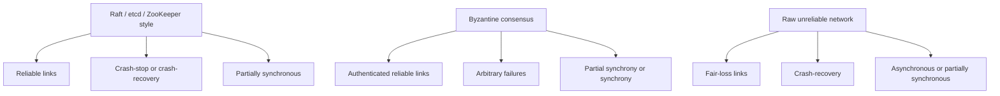

## Design-review framing

Use this framing before proposing a design:

> I want to make the system model explicit. For normal internal infrastructure, I would assume crash-recovery nodes, reliable links built over fair-loss networks, and partial synchrony. That means nodes can crash and restart, messages can be delayed or lost underneath the abstraction, and timeouts are only failure suspicions. For strong consistency, safety should not depend on timing; I would use quorum or consensus. If the system must tolerate malicious nodes, then the model changes to arbitrary failures with authenticated reliable links, which requires a Byzantine-fault-tolerant design.

## Related patterns

- [Heartbeat](../02-leaders-and-followers/02-heartbeat.md)
- [Majority Quorum](../03-consensus-and-commit/01-majority-quorum.md)
- [Generation Clock](../03-consensus-and-commit/02-generation-clock.md)
- [Replicated Log](../03-consensus-and-commit/05-replicated-log.md)
- [Lease](../06-cluster-management/02-lease.md)
- [Gossip Dissemination](../06-cluster-management/04-gossip-dissemination.md)
