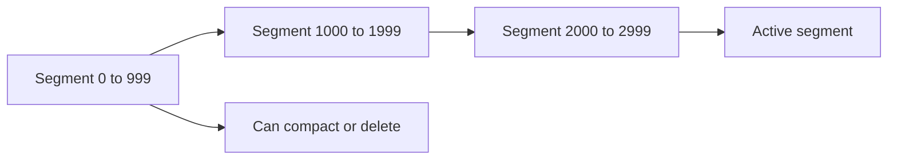

# Segmented Log

> Split a growing append-only log into bounded files or segments.

## Problem

A single ever-growing log file becomes difficult to delete, compact, search, archive, and recover from.

## Solution

Write log entries into fixed-size or time-bounded segment files. Keep the active segment open for appends and mark older segments immutable. Delete, compact, copy, or index complete segments independently.

## Diagram

## Examples

- Kafka topic partitions stored as multiple log segments.
- Database WAL files rotated into segment files.
- Event stores divided into segment files for retention.

## Watch outs

- Segment size impacts recovery time and file-system overhead.
- Metadata must map logical offsets to segment files.
- Deletion is safe only when consumers and replicas no longer need the segment.

## Related patterns

- Write-Ahead Log
- Low-Water Mark
- High-Water Mark
