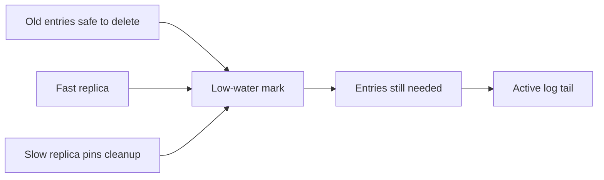

# Low-Water Mark

> Track the earliest log position that must still be retained.

## Problem

A system cannot delete old log entries just because the local node no longer needs them. Slow replicas, consumers, backups, or recovery processes may still depend on older entries.

## Solution

Maintain a low-water mark: the minimum offset or index still required by the cluster or by recovery. Entries below it can be compacted, snapshotted, archived, or deleted.

## Diagram

## Examples

- Databases keep WAL until replicas and backups no longer need it.
- Consensus systems keep log entries until followers or snapshots make them safe to discard.
- Log systems use consumer or replica progress to decide cleanup boundaries.

## Watch outs

- A stuck replica can pin cleanup forever.
- Deleting too early can force full snapshot copy or cause data loss.
- Track per-consumer and per-replica progress explicitly.

## Related patterns

- Segmented Log
- High-Water Mark
- Follower Reads
