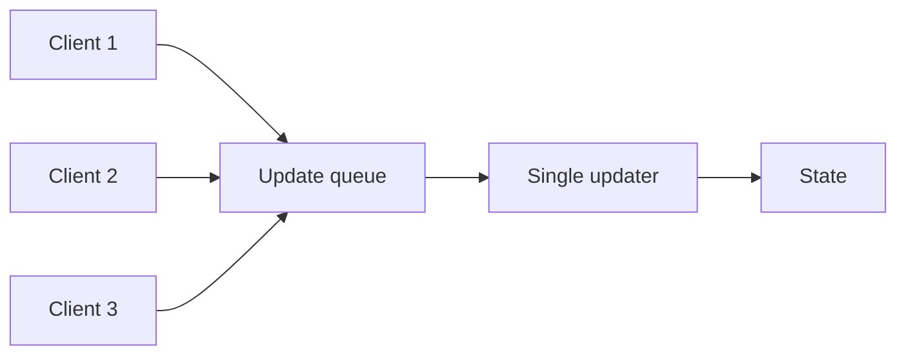

# Singular Update Queue

> Serialize state changes through one ordered queue to avoid concurrent mutation races.

## Problem

Concurrent updates can interleave in unsafe ways, causing lost updates, inconsistent derived state, or complex locking.

## Solution

Accept updates concurrently, enqueue them, and process them on a single update path in deterministic order. Scale by partitioning into many queues rather than adding concurrent writers to the same mutable state.

## Diagram

## Examples

- Actor model mailbox.
- Single-threaded Redis command execution.
- Partition leader serializing writes for one shard.

## Watch outs

- One queue can become a bottleneck.
- Long-running operations block later updates.
- Partitioning is the usual scaling mechanism.

## Related patterns

- Write-Ahead Log
- Leader and Followers
- Fixed Partitions
