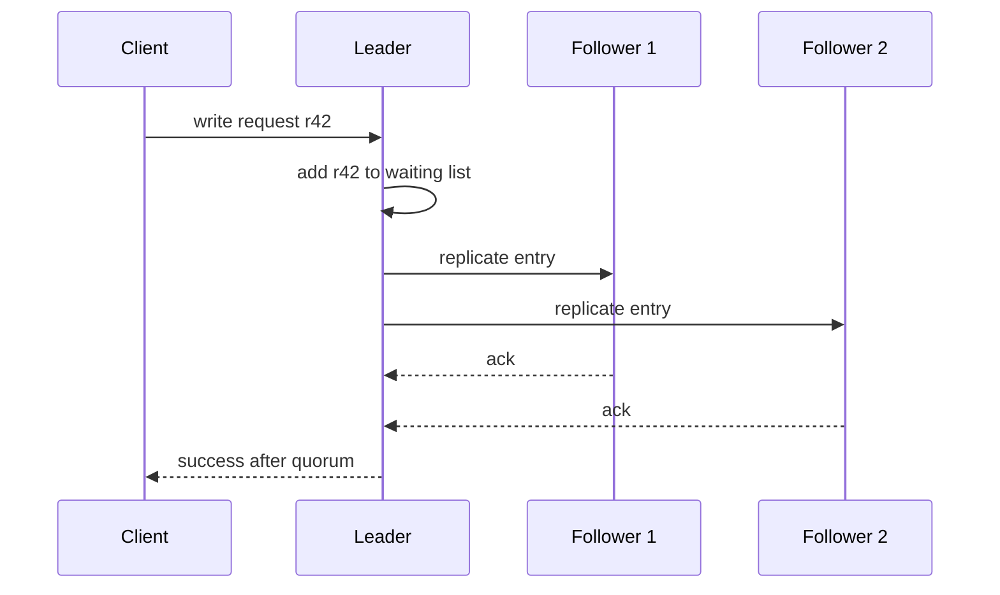

# Request Waiting List

> Remember in-flight client requests until the cluster has enough evidence to answer.

## Problem

A coordinator often cannot respond immediately. It may need quorum acknowledgements, follower replication, disk persistence, or a participant decision.

## Solution

Store each pending request in a waiting list keyed by request ID or log index. Update its state as responses arrive. Complete it only when the response criteria is satisfied.

## Diagram

## Examples

- Leader waits for follower acknowledgements before commit.
- Coordinator waits for participants during two-phase commit.
- RPC layer tracks correlation IDs until replies return.

## Watch outs

- Waiting lists need timeout and cleanup.
- Coordinator restart needs recovery or client retry.
- Duplicate replies must not complete a request twice.

## Related patterns

- Majority Quorum
- High-Water Mark
- Idempotent Receiver
