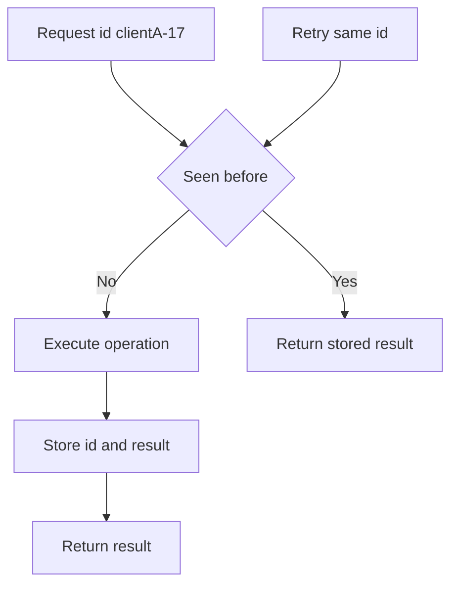

# Idempotent Receiver

> Give requests unique IDs so retried messages do not execute twice.

## Problem

Clients retry when they see timeouts. The original request may still have succeeded, so the receiver can accidentally apply the same operation twice.

## Solution

Attach a stable client ID and request sequence or idempotency key to every operation. The receiver stores processed IDs and returns the previous result for duplicates instead of re-executing the operation.

## Diagram

## Examples

- Payment APIs use idempotency keys.
- Kafka idempotent producers use producer IDs and sequence numbers.
- Lock services deduplicate session requests.

## Watch outs

- Deduplication state needs retention limits.
- Request IDs must be stable across retries.
- Store the response along with the side effect.

## Related patterns

- Request Waiting List
- Write-Ahead Log
- Two-Phase Commit
