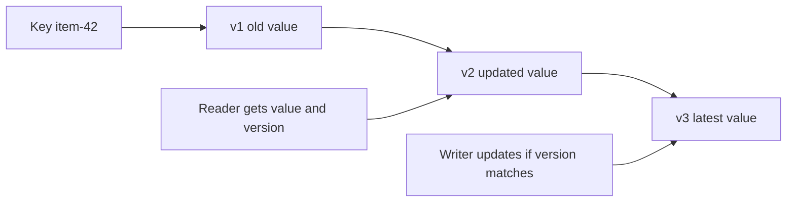

# Versioned Value

> Store values with versions so readers and writers know which version they observed.

## Problem

Distributed replicas may receive updates at different times. A read or write without version information cannot tell whether it is seeing stale data or overwriting a newer value.

## Solution

Attach a monotonically increasing version or timestamp to each value. Reads return value plus version. Writes can check expected version or create a new version.

## Diagram

## Examples

- MVCC row versions.
- Object-store ETags or version IDs.
- Cache compare-and-set tokens.

## Watch outs

- A single counter works well with one writer but not many independent writers.
- Wall-clock timestamps can be unsafe under clock skew.
- Concurrent writes may need version vectors or merge logic.

## Related patterns

- Version Vector
- Lamport Clock
- Hybrid Clock
