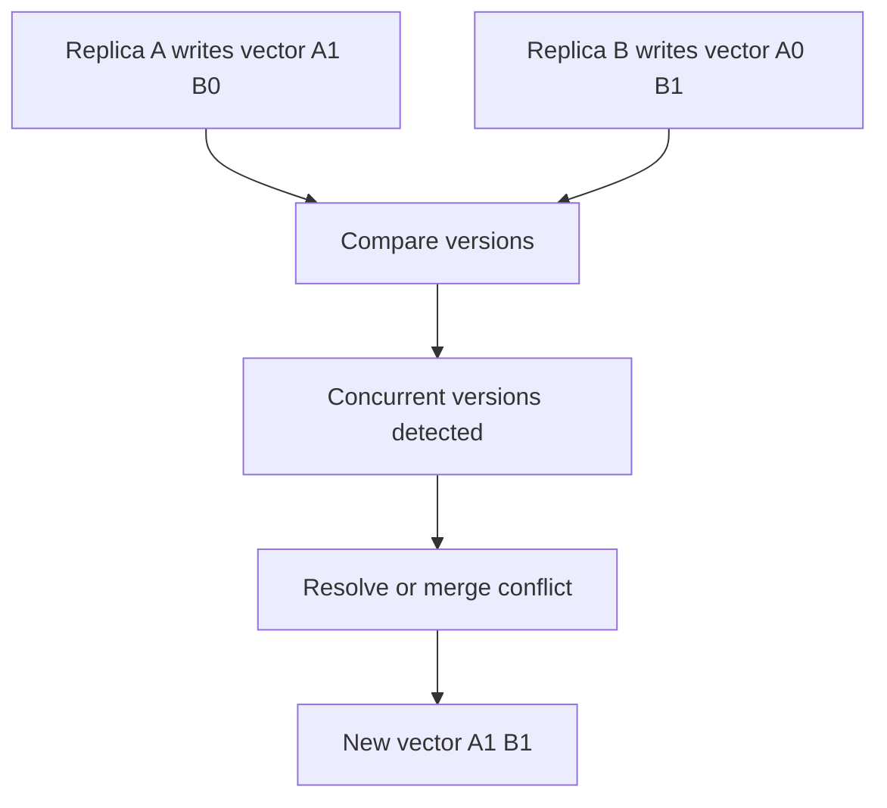

# Version Vector

> Track one version counter per replica to detect concurrent updates.

## Problem

With multi-leader or leaderless replication, two replicas can update the same value independently. A single version number cannot distinguish causally newer updates from concurrent conflicting updates.

## Solution

Maintain a vector of counters, one per replica. Increment the local replica counter on writes and merge vectors during replication. Compare vectors to identify before, after, equal, or concurrent updates.

## Diagram

## Examples

- Dynamo-style systems use vector clocks.
- Offline-first systems use causal metadata.
- Eventually consistent systems use vectors to detect conflicts.

## Watch outs

- Vector size grows with number of writers or replicas.
- You still need application-specific conflict resolution.
- Version vectors detect concurrency; they do not automatically merge arbitrary data.

## Related patterns

- Versioned Value
- Lamport Clock
- Gossip Dissemination
