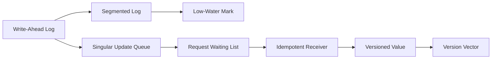

# Data Replication

Make state durable, replayable, copied, deduplicated, versioned, and recoverable.

## Patterns

- [Write-Ahead Log](01-write-ahead-log.md)
- [Segmented Log](02-segmented-log.md)
- [Low-Water Mark](03-low-water-mark.md)
- [Singular Update Queue](04-singular-update-queue.md)
- [Request Waiting List](05-request-waiting-list.md)
- [Idempotent Receiver](06-idempotent-receiver.md)
- [Versioned Value](07-versioned-value.md)
- [Version Vector](08-version-vector.md)

## Design trigger

Use this section when the question involves crash recovery, replica catch-up, retry safety, deduplication, log cleanup, or conflict detection.
