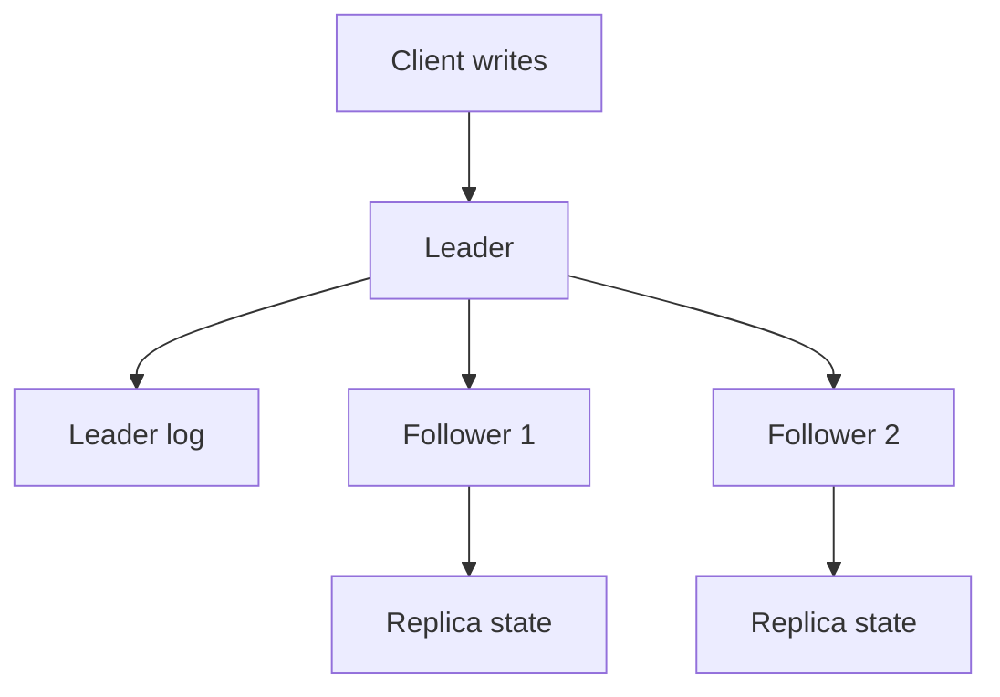

# Leader and Followers

> Route writes through one leader that coordinates replication to followers.

## Problem

If multiple replicas accept writes independently, they may diverge or apply updates in different orders. Clients need a simple write path and replicas need a common order.

## Solution

Use one node as leader for a partition or cluster. The leader accepts writes, orders them, appends them to its log, and replicates them to followers. Followers apply entries in leader order.

## Diagram

## Examples

- Primary-replica database replication.
- Kafka partition leader and follower replicas.
- Raft leader coordinating a replicated log.
- MySQL or PostgreSQL primary with read replicas.

## Watch outs

- The leader is a bottleneck for its shard.
- Leader failure needs election or failover.
- Async followers can be stale; sync followers add write latency.

## Related patterns

- Heartbeat
- Follower Reads
- Replicated Log
- Majority Quorum
