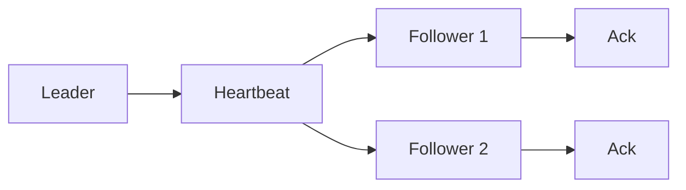

# Heartbeat

> Send periodic liveness messages so other nodes know a server is still reachable.

## Problem

A node may stop responding or the network may become slow. Other nodes need a practical signal to decide whether to take recovery action.

## Solution

Send heartbeat messages at a fixed interval. Receivers track the last heartbeat time and start recovery if the timeout is crossed.

## Diagram

## Examples

- Raft leader heartbeats.
- Cluster membership liveness checks.
- Service registry health checks.

## Watch outs

- Timeouts are practical signals, not proof.
- Very small timeouts create noisy recovery.
- Very large timeouts slow recovery.

## Related patterns

- Leader and Followers
- Lease
- Emergent Leader
