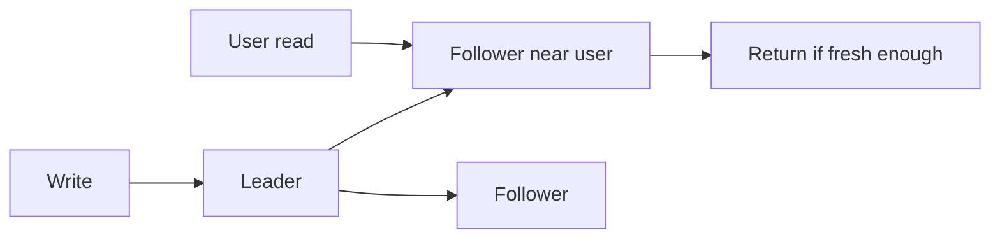

# Follower Reads

> Serve read traffic from followers to reduce leader load and latency.

## Problem

If every read goes to the leader, the leader can become a bottleneck even when followers have enough data to answer. But followers may lag behind the leader.

## Solution

Allow reads from followers under an explicit freshness policy. Options include stale reads, bounded-staleness reads, lease-validated reads, or reads only up to a known committed high-water mark.

## Diagram

## Examples

- Read replicas in relational databases.
- Geo-replicated systems serving local bounded-stale reads.
- Consensus systems serving follower reads after freshness checks.

## Watch outs

- Follower reads can violate read-your-writes.
- Fresh reads may require leader validation.
- Staleness must be visible in API or SLA.

## Related patterns

- High-Water Mark
- Lease
- Leader and Followers
