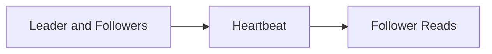

# Leaders and Followers

Organize replicas when one node coordinates writes and others follow.

## Patterns

- [Leader and Followers](01-leader-and-followers.md)
- [Heartbeat](02-heartbeat.md)
- [Follower Reads](03-follower-reads.md)

## Interview trigger

Use this section when the system has one writer per shard, replicas, failover, read replicas, or stale-read tradeoffs.
