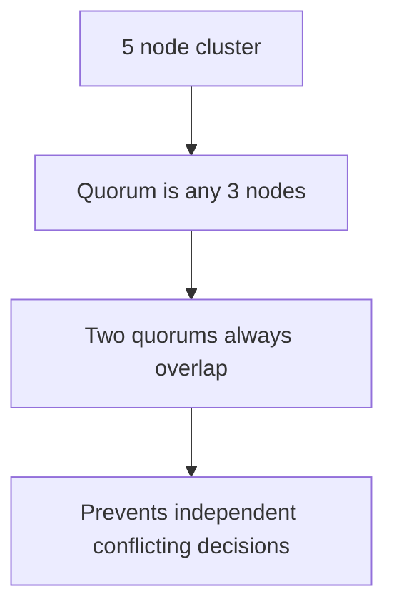

# Majority Quorum

> Require a majority of nodes before accepting a decision.

## Problem

A network split can divide a cluster into groups. If both groups make independent decisions, the system can choose conflicting leaders or writes.

## Solution

Define a quorum as more than half of voting members. Only a quorum can elect leaders or commit decisions. Any two majorities overlap in at least one node.

## Diagram

## Examples

- Raft leader election and log commit.
- Paxos acceptor majority.
- ZooKeeper style coordination clusters.

## Watch outs

- A two-node cluster cannot tolerate one node loss with majority writes.
- Even-sized clusters often waste one vote.
- Minority partitions must reject writes.

## Related patterns

- Paxos
- Generation Clock
- High-Water Mark
