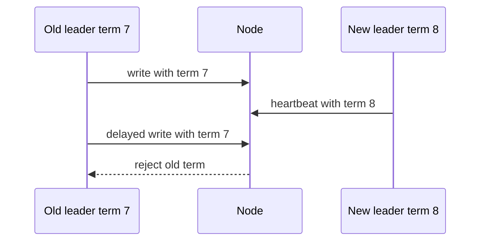

# Generation Clock

> Use monotonically increasing epochs or terms to reject stale leaders and stale messages.

## Problem

Old leaders or delayed messages can reappear after a pause or partition. Receivers need a way to identify obsolete commands.

## Solution

Attach a generation number, epoch, term, or ballot to leadership and messages. Nodes accept messages from the current or higher generation and reject older generations.

## Diagram

## Examples

- Raft term numbers.
- Paxos proposal or ballot numbers.
- Fencing tokens for leases and distributed locks.

## Watch outs

- Generation numbers must be monotonic.
- Higher generation does not automatically mean the data is committed.
- Use with quorum to prevent multiple valid leaders.

## Related patterns

- Majority Quorum
- Lease
- Paxos
