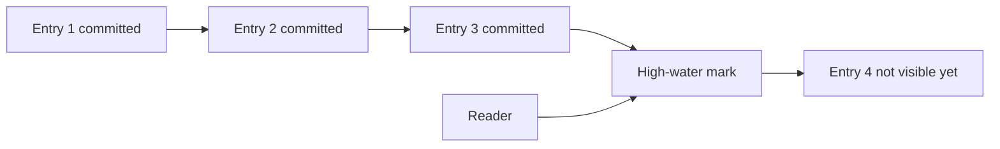

# High-Water Mark

> Track the highest log entry known to be safely replicated or committed.

## Problem

A node may have log entries that are locally appended but not yet safe to expose. Clients need responses only after the system knows which entries are committed.

## Solution

Maintain a high-water mark such as commit index. Advance it when the commit rule is met, usually after replication to a quorum. Expose only entries at or below this mark.

## Diagram

## Examples

- Raft commitIndex.
- Kafka high watermark controls visible records.
- Replicated databases expose committed log positions.

## Watch outs

- Local append offset is not the same as committed offset.
- Follower reads must respect the high-water mark.
- Leader change may remove uncommitted tail entries.

## Related patterns

- Replicated Log
- Follower Reads
- Low-Water Mark
