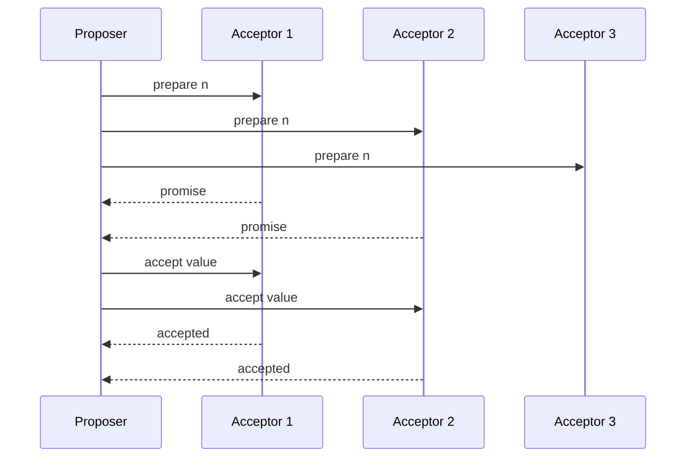

# Paxos

> Use prepare/promise and accept/accepted phases to choose one safe value despite unreliable nodes and messages.

## Problem

A cluster needs to agree on a value even when messages are delayed, nodes restart, and multiple proposers compete. Once a value is chosen, later rounds must preserve safety.

## Solution

Proposers use monotonically increasing proposal numbers. In phase one, they ask acceptors for promises. In phase two, they ask a majority to accept a safe value based on the promises they received.

## Diagram

## Examples

- Consensus over one log slot.
- Multi-Paxos optimizes repeated decisions with a stable leader.
- Coordination systems and databases use Paxos-like algorithms internally.

## Watch outs

- Basic Paxos is hard to implement correctly.
- Liveness needs a stable proposer or backoff under contention.
- Replicated state machines require repeating consensus over log slots.

## Related patterns

- Majority Quorum
- Generation Clock
- Replicated Log
