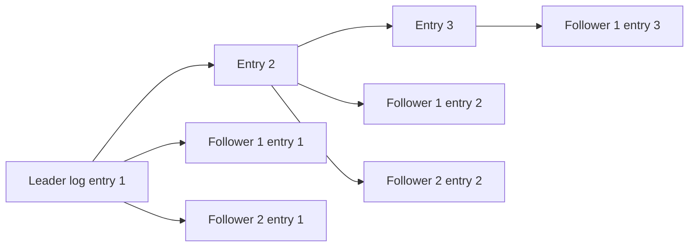

# Replicated Log

> Replicate an ordered write-ahead log so all replicas apply the same commands in the same order.

## Problem

Replicas need to stay synchronized. Sending final state is expensive and ambiguous; sending unordered operations can cause divergent state.

## Solution

Represent every state change as a log entry. Replicate entries to followers and commit them in order. Each replica applies committed entries to its local state machine.

## Diagram

## Examples

- Raft replicated log.
- Multi-Paxos over log slots.
- Kafka partition replication.
- Database WAL streaming.

## Watch outs

- The log is the source of ordering.
- Uncommitted tail entries can be replaced during leader changes.
- Snapshots are needed to avoid replaying from the beginning forever.

## Related patterns

- Write-Ahead Log
- High-Water Mark
- Paxos
