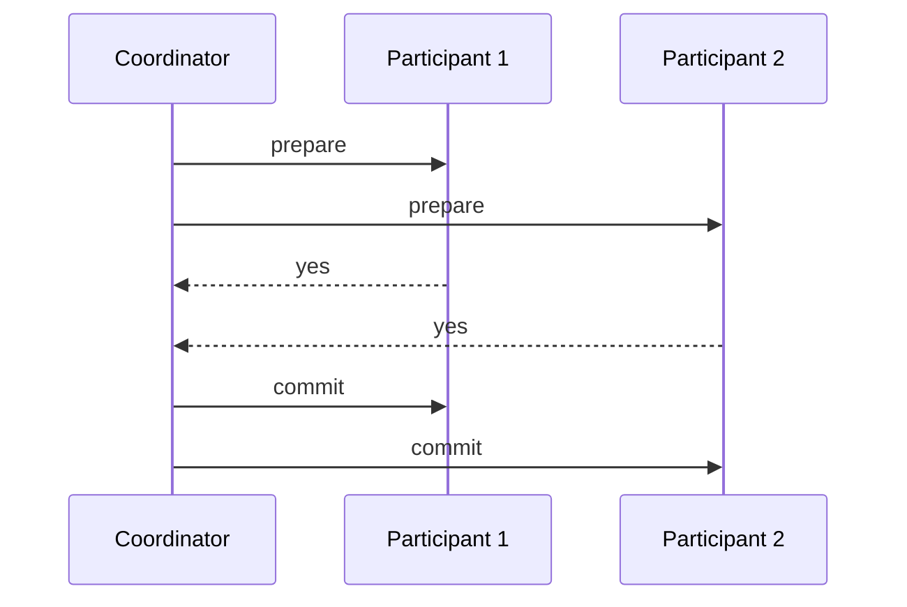

# Two-Phase Commit

> Coordinate multiple participants so a transaction reaches one outcome everywhere.

## Problem

A transaction updates multiple nodes or resources. If one side commits while another side aborts, the system becomes inconsistent.

## Solution

Use a coordinator. Phase one asks all participants to prepare and promise they can commit. If all vote yes, phase two tells everyone to commit; otherwise it tells everyone to abort.

## Diagram

## Examples

- Distributed transactions across database shards.
- XA transactions across resources.
- Atomic commit between transactional systems.

## Watch outs

- Two-phase commit is atomic commit, not consensus.
- Prepared participants can block if the coordinator disappears before the final decision.
- Long transactions hold locks and hurt availability.

## Related patterns

- Request Waiting List
- Idempotent Receiver
- Majority Quorum
