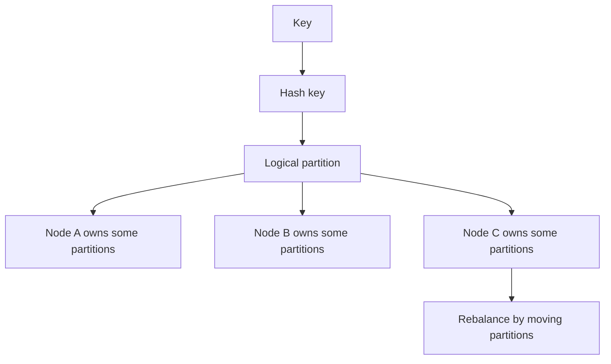

# Fixed Partitions

> Keep the logical partition count stable even when the number of servers changes.

## Problem

If keys map directly to physical nodes, adding or removing a node reshuffles too much data and breaks routing.

## Solution

Map keys to a fixed set of logical partitions. Assign partitions to physical nodes. When servers change, move partition ownership rather than changing the key-to-partition mapping.

## Diagram

## Examples

- Cassandra-style virtual nodes.
- Kafka partitions assigned to brokers.
- Dynamo-style token ranges.

## Watch outs

- Too few partitions makes rebalancing coarse.
- Too many partitions increases metadata and overhead.
- Hot keys can still overload one partition.

## Related patterns

- Key-Range Partitions
- Leader and Followers
- Gossip Dissemination
