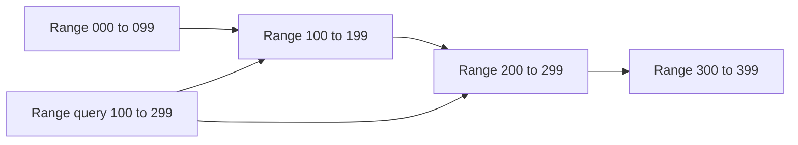

# Key-Range Partitions

> Partition sorted keys into contiguous ranges.

## Problem

Hash partitioning spreads load but destroys ordering. Range queries, prefix scans, and ordered iteration become expensive across many partitions.

## Solution

Assign contiguous key ranges to partitions. Route each request by comparing the key with range boundaries. Split or merge ranges as data and load change.

## Diagram

## Examples

- Bigtable-style tablets.
- LSM-tree systems partitioning by sorted key ranges.
- Time-series data partitioned by time range.

## Watch outs

- Sequential inserts can create hot ranges.
- Range boundaries need split and merge management.
- Uneven key distribution causes skew.

## Related patterns

- Fixed Partitions
- Segmented Log
- Singular Update Queue
