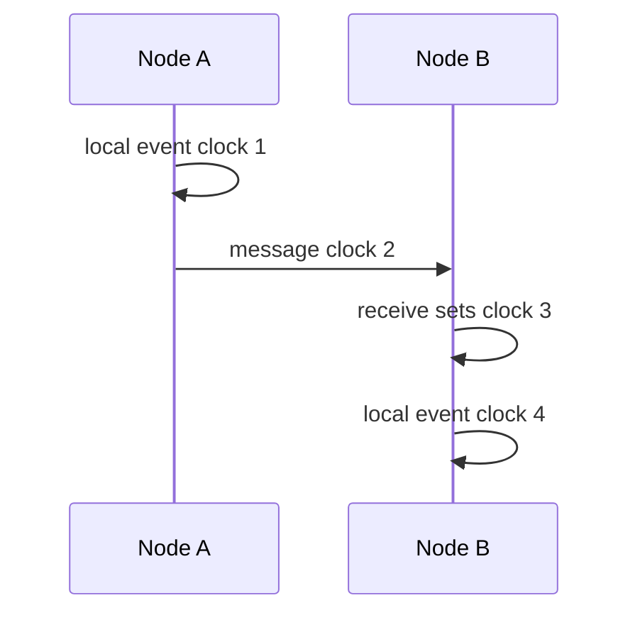

# Lamport Clock

> Use logical counters to preserve causal ordering between events.

## Problem

Physical clocks can drift, so timestamps from different machines cannot reliably say which event happened first. But distributed algorithms often need causal ordering.

## Solution

Each process keeps a counter. Increment it for local events. Send it with messages. On receive, set local counter to max local or received plus one.

## Diagram

## Examples

- Ordering metadata in distributed algorithms.
- Causal relationships in logs.
- Foundation for more advanced logical time schemes.

## Watch outs

- Lamport clocks cannot detect concurrency by themselves.
- Lower timestamp does not always mean causality.
- Tie-break with node ID for total ordering.

## Related patterns

- Versioned Value
- Version Vector
- Hybrid Clock
