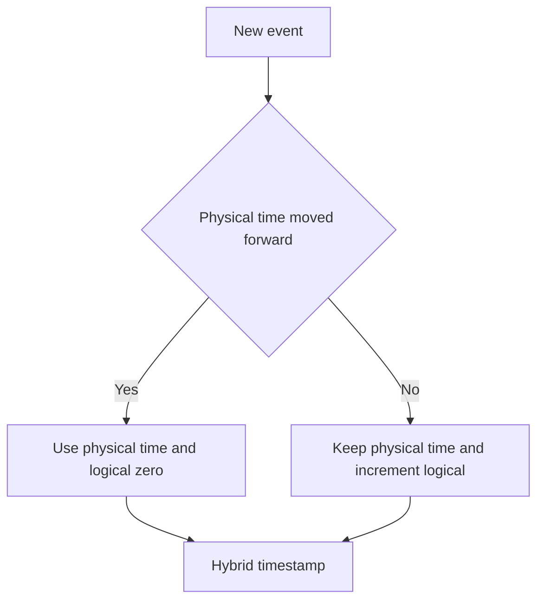

# Hybrid Clock

> Combine physical time with a logical counter for sortable, causality-aware timestamps.

## Problem

Pure logical clocks do not map to real time, while physical clocks can move differently across nodes. Many systems need timestamps that are close to wall-clock time but still safe for ordering.

## Solution

Maintain a timestamp with a physical component and a logical component. Use physical time when it moves forward; increment the logical counter when events occur at the same or older physical time.

## Diagram

## Examples

- Hybrid Logical Clocks in distributed databases.
- Causally ordered event timestamps that remain human-readable.
- Multi-region systems needing bounded timestamp ordering.

## Watch outs

- Hybrid clocks still depend on clock-sync quality.
- They do not automatically make stale reads safe.
- Clock jumps need careful handling.

## Related patterns

- Lamport Clock
- Clock-Bound Wait
- Versioned Value
