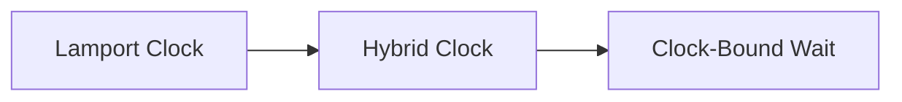

# Distributed Time

Reason about event order when clocks are imperfect and messages are delayed.

## Patterns

- [Lamport Clock](01-lamport-clock.md)
- [Hybrid Clock](02-hybrid-clock.md)
- [Clock-Bound Wait](03-clock-bound-wait.md)

## Interview trigger

Use this section when the design depends on ordering, causality, freshness, or real-time consistency across nodes.
