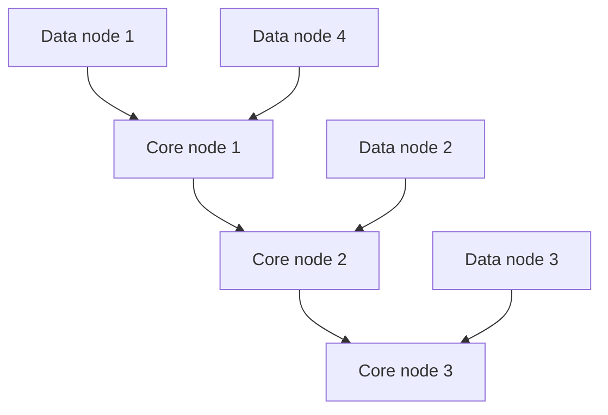

# Consistent Core

> Use a small strongly consistent cluster to coordinate a larger data cluster.

## Problem

Implementing strong consistency across every data node is expensive. But the larger cluster still needs reliable metadata such as membership, leases, leader assignment, and configuration.

## Solution

Run a small coordination core using consensus. Store metadata and decisions there. The larger data plane reads or watches this core instead of implementing quorum logic everywhere.

## Diagram

## Examples

- ZooKeeper, etcd, or Consul coordinating larger systems.
- Kubernetes using etcd as metadata store.
- HBase-style systems using a coordination service.

## Watch outs

- The core becomes critical infrastructure.
- Do not put high-volume data-path traffic into the core.
- Core availability depends on quorum.

## Related patterns

- Majority Quorum
- Lease
- State Watch
