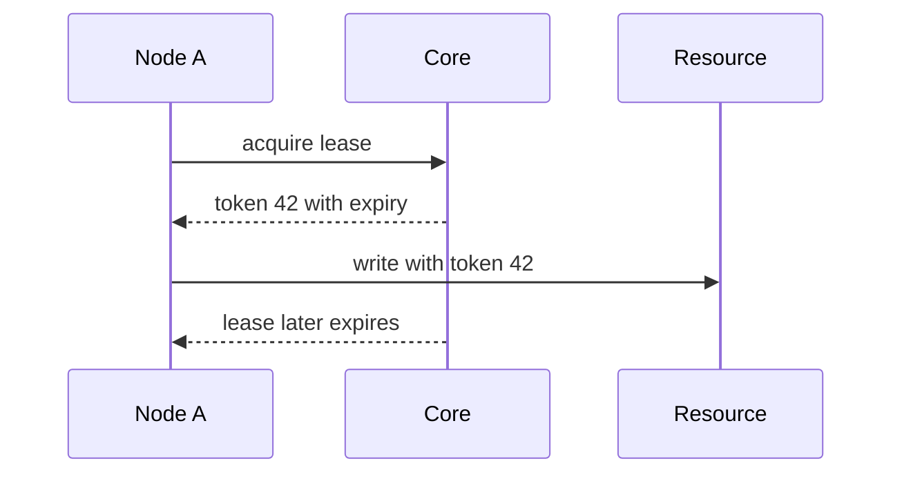

# Lease

> Grant ownership for a limited time instead of forever.

## Problem

A node that owns a resource may pause, disconnect, or stop renewing. If ownership is permanent, other nodes cannot safely take over. If takeover is immediate, stale owners may still act.

## Solution

Give ownership with an expiry time. The owner must renew before expiry. Others can take over only after expiry. Use fencing tokens to reject stale owners when they contact external systems.

## Diagram

## Examples

- Distributed lock with TTL.
- Leader lease for read optimization.
- Shard ownership lease in a scheduler or storage system.

## Watch outs

- Clock assumptions matter.
- Prefer fencing tokens for writes to external systems.
- Lease duration controls recovery time versus renewal overhead.

## Related patterns

- Generation Clock
- Clock-Bound Wait
- State Watch
