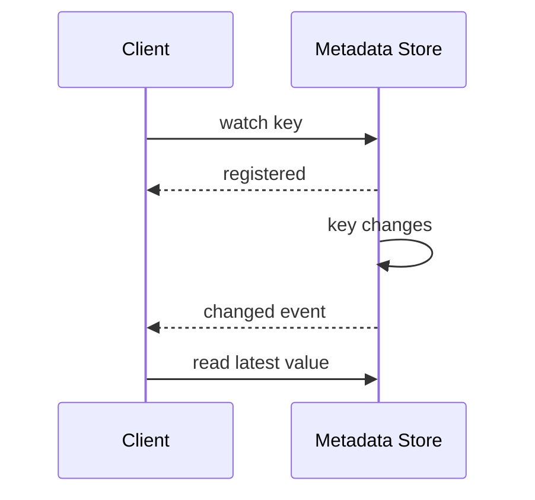

# State Watch

> Let clients subscribe to state changes instead of polling continuously.

## Problem

Clients need to react to metadata changes such as membership, leader changes, or configuration updates. Polling causes latency, load, and noisy traffic.

## Solution

Clients register a watch on a key, path, or state item. The server notifies watchers when the state changes. Clients then read the new value and usually re-register the watch.

## Diagram

## Examples

- ZooKeeper watches.
- etcd watch API.
- Kubernetes controllers watching API resources.

## Watch outs

- Clients must handle missed events by re-reading state.
- Watch contracts can be one-shot or resumable.
- Large fan-out requires backpressure.

## Related patterns

- Consistent Core
- Lease
- Gossip Dissemination
