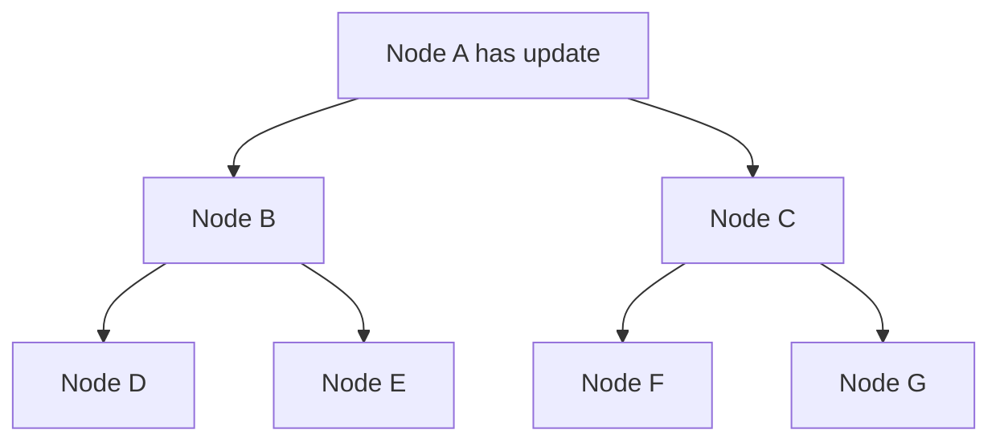

# Gossip Dissemination

> Spread information by repeatedly exchanging it with randomly selected peers.

## Problem

Broadcasting every update to every node causes high network load and centralized bottlenecks. But cluster state still needs to reach all nodes eventually.

## Solution

Each node periodically selects a few peers and shares what it knows. Information spreads epidemically until the cluster converges.

## Diagram

## Examples

- Cassandra gossip for cluster metadata.
- SWIM-style membership dissemination.
- Eventually consistent node state spread.

## Watch outs

- Gossip is eventually consistent, not instant.
- Convergence depends on fanout and interval.
- False liveness signals need correction.

## Related patterns

- Heartbeat
- Version Vector
- Fixed Partitions
