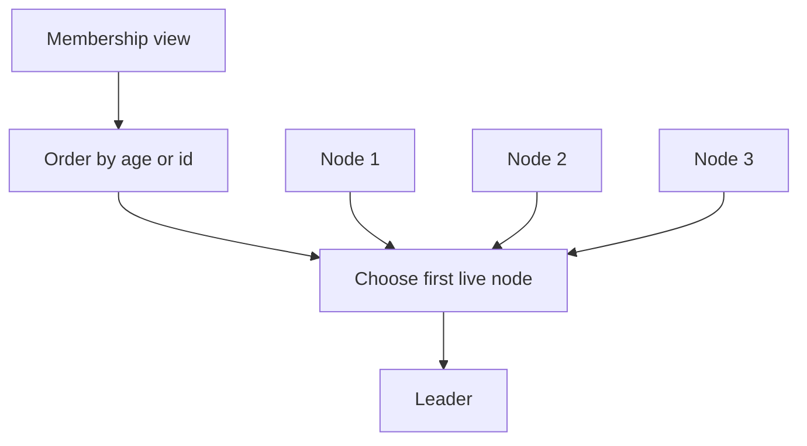

# Emergent Leader

> Let nodes independently choose the same leader based on deterministic ordering.

## Problem

Some clusters need a coordinator, but running an explicit election protocol may be overkill when membership is already known and ordered.

## Solution

Order nodes by age, ID, priority, or another deterministic attribute. Each node independently selects the highest-priority live member as leader.

## Diagram

## Examples

- Oldest-node-wins leader selection.
- Lowest-ID or highest-priority coordinator.
- Simple leader choice on top of a consistent membership list.

## Watch outs

- Different membership views can create temporary disagreement.
- Use with a consistent core or lease for stronger safety.
- Not a substitute for consensus when correctness requires one leader.

## Related patterns

- Heartbeat
- Lease
- Consistent Core
