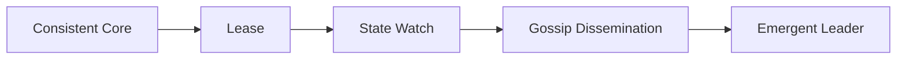

# Cluster Management

Coordinate membership, ownership, configuration, liveness, and metadata.

## Patterns

- [Consistent Core](01-consistent-core.md)
- [Lease](02-lease.md)
- [State Watch](03-state-watch.md)
- [Gossip Dissemination](04-gossip-dissemination.md)
- [Emergent Leader](05-emergent-leader.md)

## Design trigger

Use this section when the design needs membership, ownership, configuration, liveness, metadata, leases, or decentralized state spread.
