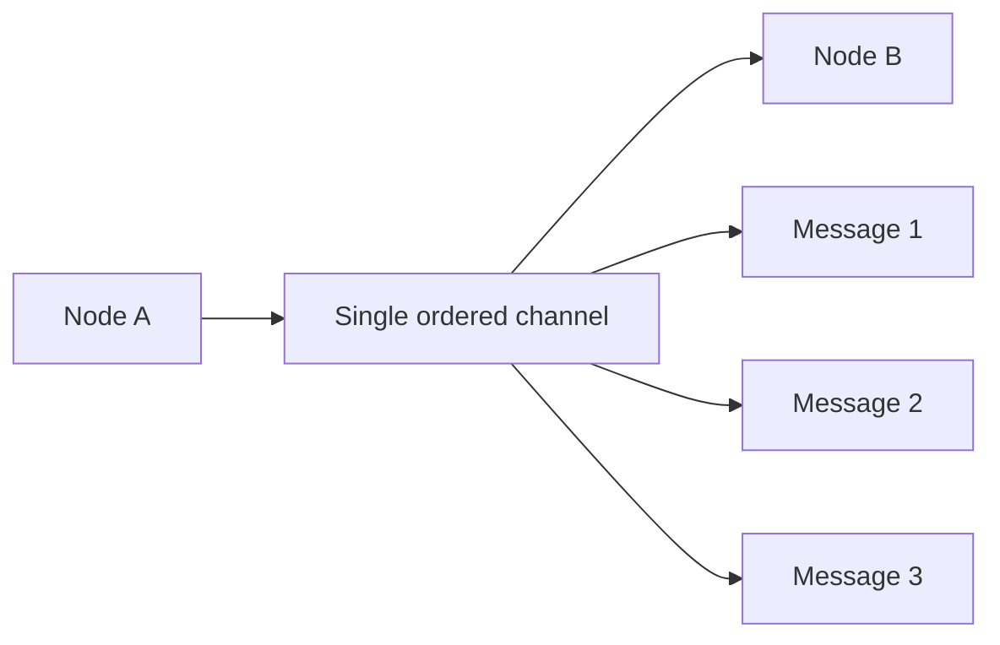

# Single-Socket Channel

> Use one TCP connection between two nodes when request ordering matters.

## Problem

Multiple connections can reorder requests and responses. Some protocols require messages to be processed in the order they were sent.

## Solution

Maintain one long-lived TCP connection between a pair of nodes for ordered communication. Multiplex logical requests over the connection if needed.

## Diagram

## Examples

- Leader-to-follower replication stream.
- Broker-to-broker ordered protocol links.
- Database replication over one ordered connection.

## Watch outs

- One connection can suffer head-of-line blocking.
- Reconnect logic must resume safely from known offsets.
- Use request pipeline or batching to improve throughput.

## Related patterns

- Request Pipeline
- Request Batch
- Replicated Log
