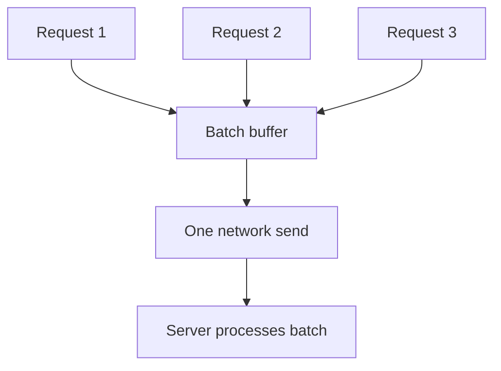

# Request Batch

> Group multiple requests into one network round trip or disk operation.

## Problem

Sending many tiny requests wastes CPU, network, syscall, and disk overhead. Per-request cost dominates useful work.

## Solution

Accumulate requests for a short time or until a size threshold, then send or process them together. Preserve per-request responses if clients need them.

## Diagram

## Examples

- Kafka producer batching records.
- Database batch inserts.
- Replication sending multiple log entries at once.

## Watch outs

- Batching adds queueing latency.
- Large batches can increase tail latency and retry cost.
- Need partial failure handling.

## Related patterns

- Request Pipeline
- Single-Socket Channel
- Segmented Log
