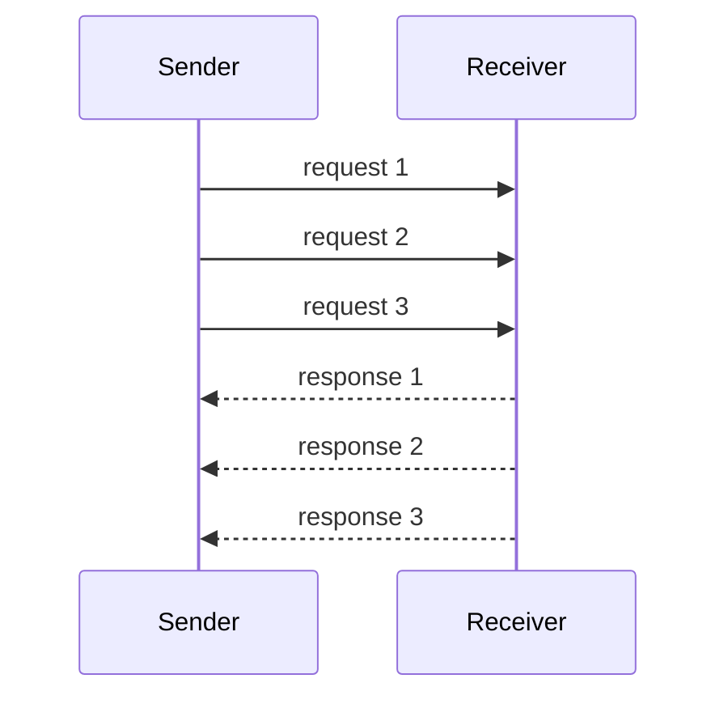

# Request Pipeline

> Send multiple requests without waiting for each previous response.

## Problem

A strict request-response loop wastes network round-trip time. The sender waits idle while the receiver and network could handle more work.

## Solution

Allow multiple outstanding requests on the same connection. Match responses to requests by order or correlation ID. This keeps the pipe full and improves throughput when round-trip latency is high.

## Diagram

## Examples

- Replication leader sends several log entries before all acknowledgements return.
- Database clients pipeline commands to reduce round trips.
- Internal service protocols use correlation IDs for multiple in-flight requests.

## Watch outs

- Too many in-flight requests increase memory and retry complexity.
- Failures need clear replay boundaries.
- Ordered responses can still suffer head-of-line blocking.

## Related patterns

- Request Batch
- Single-Socket Channel
- Request Waiting List
