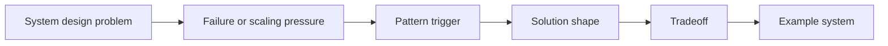

# How to use this knowledge base

Use this repo as a quick reference before system design discussions, architecture reviews, or deep dives.

## Recall loop



For each pattern, answer:

| Question | Example |
|---|---|
| What breaks without this? | Retry duplicates cause double payment. |
| What is the core design move? | Use idempotency key and stored response. |
| What does it cost? | Need deduplication storage and retention. |
| What systems use it? | Payment APIs, Kafka producers, replicated logs. |

## Good answer shape

> The problem is X. If we do nothing, Y fails. The pattern is Z. It works by A, B, C. The tradeoff is T. A real example is E.

## Local preview

```bash
pip install -r requirements.txt
mkdocs serve
```
