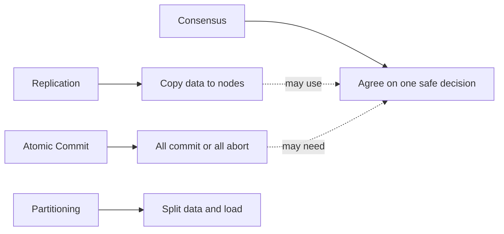
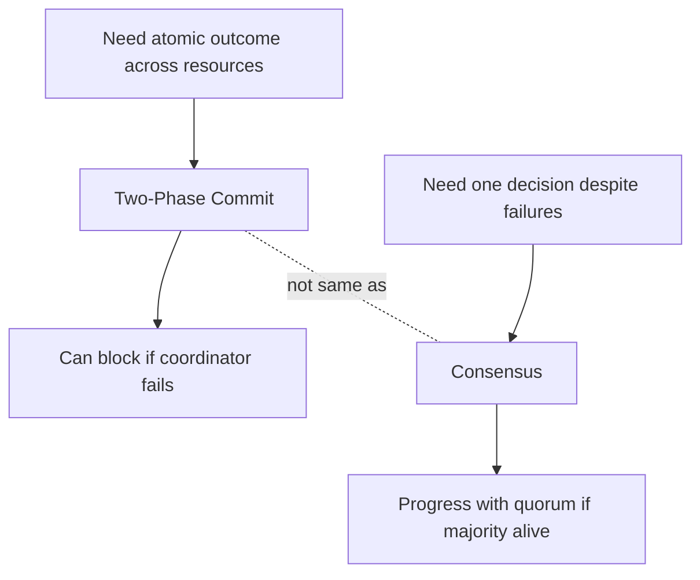

# Interview Cheat Sheet

## Pattern triggers

| Interview phrase | Pattern to reach for |
|---|---|
| Node crashes after accepting a write | Write-Ahead Log |
| Need to truncate old logs | Low-Water Mark + Segmented Log |
| Replicas must agree on write order | Leader and Followers + Replicated Log |
| Avoid split-brain | Majority Quorum + Generation Clock |
| Know what is committed | High-Water Mark |
| Avoid duplicate retries | Idempotent Receiver |
| Scale writes by key | Fixed Partitions |
| Support range scans | Key-Range Partitions |
| Order events without trusting clocks | Lamport Clock |
| Use physical time safely | Hybrid Clock / Clock-Bound Wait |
| Notify config changes | State Watch |
| Spread membership state | Gossip Dissemination |
| Reduce network overhead | Request Batch |
| Hide RTT | Request Pipeline |

## Core distinction

## 2PC vs Consensus

