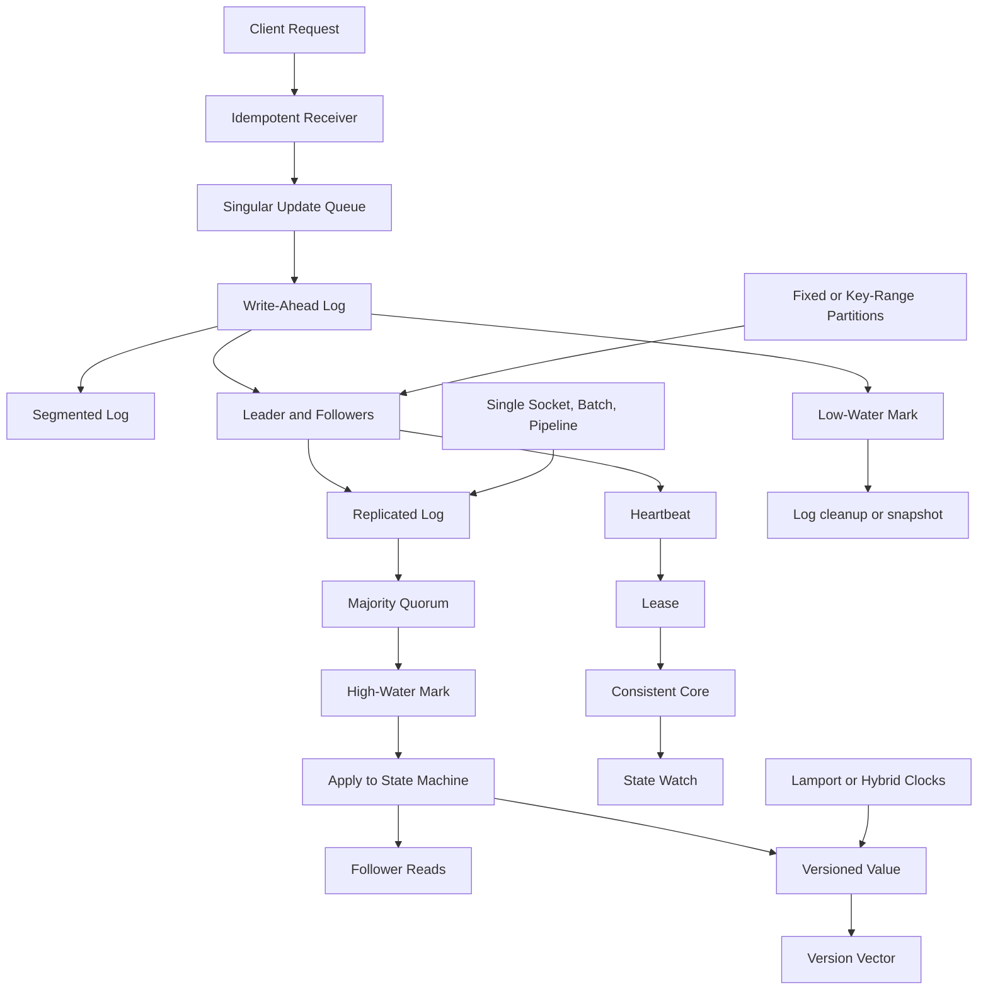

# Pattern Map

## End-to-end map

## Index

| Section | Patterns |
|---|---|
| Data Replication | Write-Ahead Log, Segmented Log, Low-Water Mark, Singular Update Queue, Request Waiting List, Idempotent Receiver, Versioned Value, Version Vector |
| Leaders and Followers | Leader and Followers, Heartbeat, Follower Reads |
| Consensus and Commit | Majority Quorum, Generation Clock, High-Water Mark, Paxos, Replicated Log, Two-Phase Commit |
| Data Partitioning | Fixed Partitions, Key-Range Partitions |
| Distributed Time | Lamport Clock, Hybrid Clock, Clock-Bound Wait |
| Cluster Management | Consistent Core, Lease, State Watch, Gossip Dissemination, Emergent Leader |
| Communication Between Nodes | Single-Socket Channel, Request Batch, Request Pipeline |
