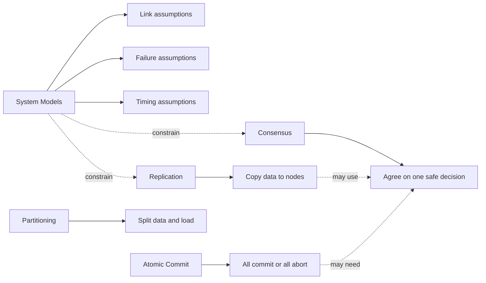
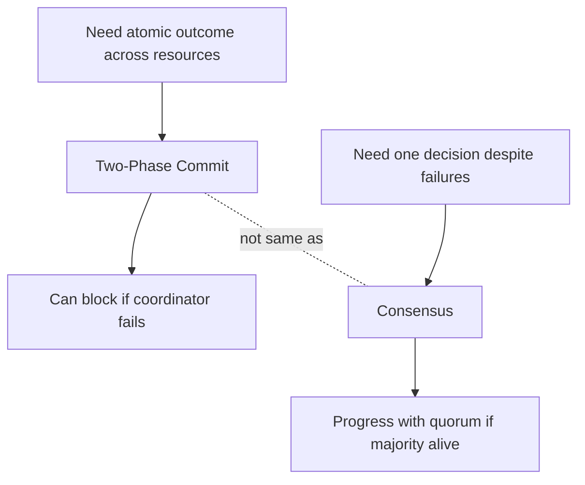

# Quick Reference

## System model triggers

| Design question | Model to make explicit |
|---|---|
| Can messages be lost, duplicated, or reordered? | Link / network model |
| Is retry enough, or do we need deduplication? | Fair-loss link vs reliable link |
| Can nodes impersonate each other or tamper with messages? | Authenticated reliable link |
| Can a node only stop, or can it restart? | Crash-stop vs crash-recovery |
| Can a node lie or send conflicting data? | Arbitrary / Byzantine failure |
| Are timeouts proof of failure or only suspicion? | Synchronous vs asynchronous / partially synchronous |
| Does safety depend on timing? | If yes, the design is fragile; prefer quorum/consensus/fencing |

## Pattern triggers

| Design situation | Pattern to reach for |
|---|---|
| Node crashes after accepting a write | Write-Ahead Log |
| Need to truncate old logs | Low-Water Mark + Segmented Log |
| Replicas must agree on write order | Leader and Followers + Replicated Log |
| Avoid split-brain | Majority Quorum + Generation Clock |
| Know what is committed | High-Water Mark |
| Avoid duplicate retries | Idempotent Receiver |
| Scale writes by key | Fixed Partitions |
| Support range scans | Key-Range Partitions |
| Order events without trusting clocks | Lamport Clock |
| Use physical time safely | Hybrid Clock / Clock-Bound Wait |
| Notify config changes | State Watch |
| Spread membership state | Gossip Dissemination |
| Reduce network overhead | Request Batch |
| Hide RTT | Request Pipeline |

## Core distinction

## 2PC vs Consensus

## Compact system model table

| Model | Meaning | Design impact |
|---|---|---|
| Fair-loss link | Messages may be lost, duplicated, or reordered; repeated sends eventually get through. | Use retry, ACK, message id, dedup. |
| Reliable link | Correct sender to correct receiver eventually delivers once. | Build over fair-loss; hide retry/dedup inside the abstraction. |
| Authenticated reliable link | Reliable link plus sender identity and integrity. | Needed for Byzantine or adversarial settings. |
| Crash-stop | Node crashes and never returns. | Use replication, failure detection, leader election. |
| Crash-recovery | Node crashes and later restarts. | Persist critical state; replay logs; use epochs/fencing. |
| Arbitrary / Byzantine | Node can lie, corrupt, or send conflicting messages. | Use BFT protocols, authentication, larger quorums. |
| Synchronous | Known bounds on delay and processing. | Timeouts can be meaningful if bounds are true. |
| Asynchronous | No timing bounds. | Timeout is only suspicion; do not base safety on time. |
| Partially synchronous | Eventually timing becomes bounded after unstable periods. | Safety always; liveness after stabilization. |
